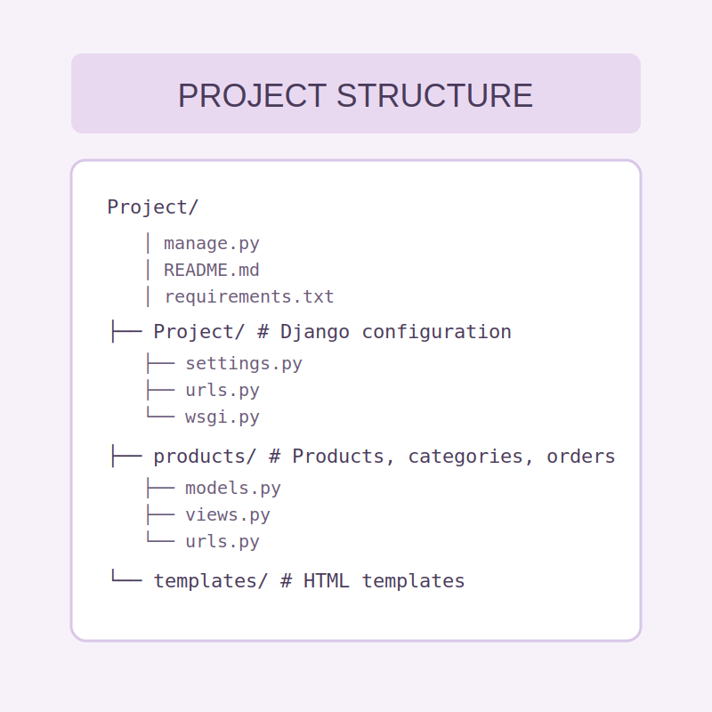
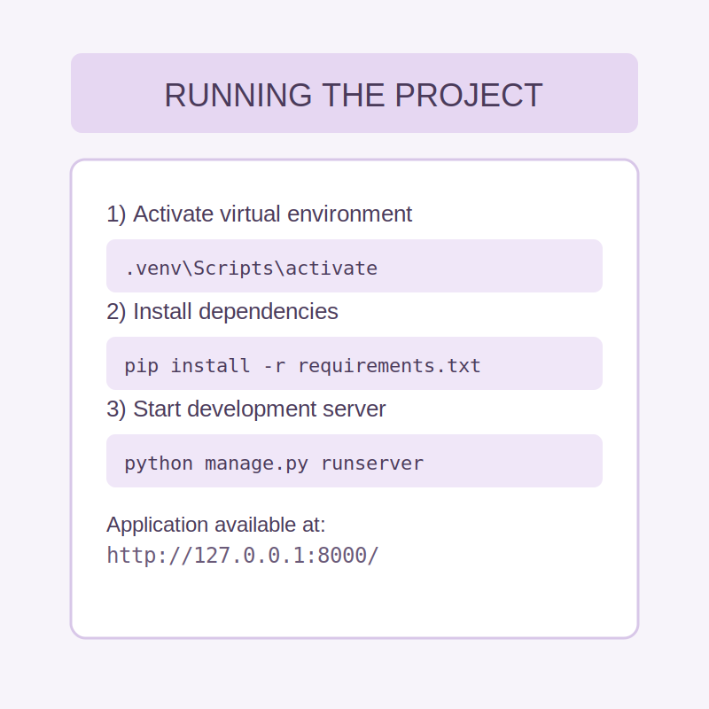
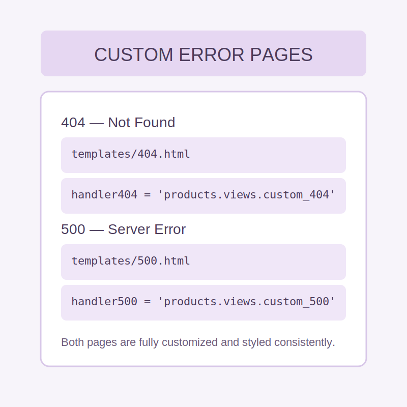
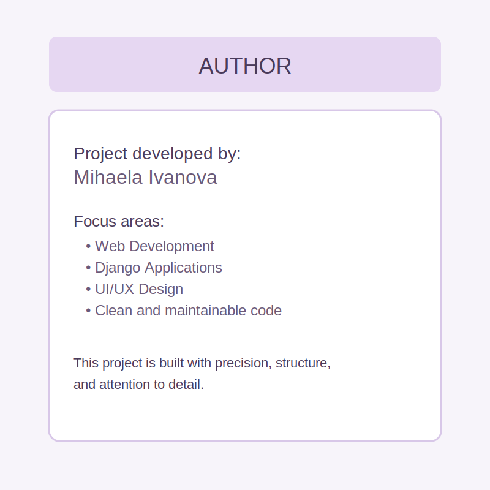

# 🌸 FlowerShop — Modern Django Web Application
FlowerShop is a modern Django web application designed as an online flower shop.
The project includes a product catalog, categories, product details, order creation, user accounts, and a clean, elegant interface.

# ✨ Key Features
🏠 Public Section
- Home page with store presentation
- Product listing
- Product detail view
- Category browsing and filtering
- Contact page

# 👤 User Management
- User registration
- Login
- User profile
- Logout

# 🗂️ Administration
- Full CRUD for products
- Full CRUD for categories
- Media file management (images)

# 🧱 Technologies Used
- Python 3
- Django
- HTML5 / CSS3
- Bootstrap 5
- SQLite (default database)
- Django Templates
- Static & Media file handling

# 📁 PROJECT STRUCTURE

# ▶️ RUNNING THE PROJECT

# ❗ CUSTOM ERROR PAGES

# 👤 AUTHOR

