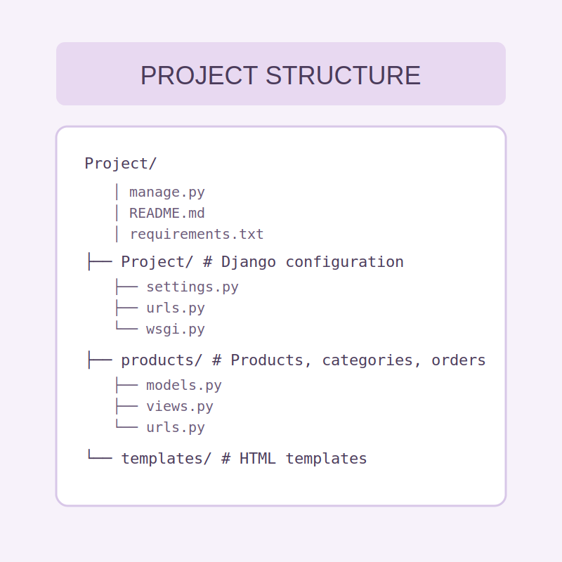
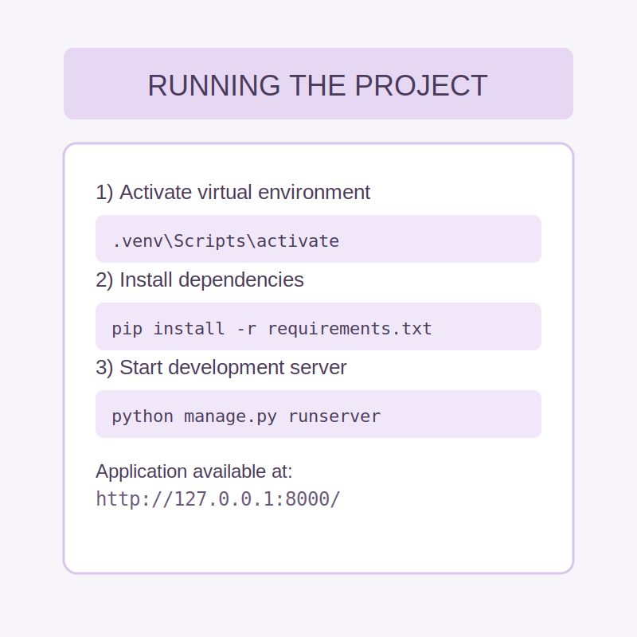

# 🌸 FlowerShop — Modern Django Web Application  
FlowerShop is a modern Django web application designed as an online flower shop.  
The project includes a product catalog, categories, product details, order creation, user accounts, reviews, and a clean, elegant interface.

---

# ✨ Key Features

## 🏠 Public Section
- Home page with featured flowers  
- Product catalog with filtering and search  
- Product details page  
- Contact form  
- User registration & login  
- Custom 404 & 500 pages  

## 🌸 Products (Flowers)
- List, detail, create, edit, delete  
- Image upload  
- Blooming season  
- In‑stock indicator  
- Category assignment  
- Tags (Many‑to‑Many)  
- Search functionality  

## 🏷 Categories & Tags
- Full CRUD for categories  
- Full CRUD for tags  
- Category delete confirmation form (read‑only)  
- Tag slugs  

## 👤 User Management
- User registration & login  
- User profile page  
- Edit profile information  
- Order creation  
- Order notes  
- Delivery address  

## ⭐ Reviews
- Authenticated users can leave reviews  
- Rating + comment  
- Reviews displayed on product detail page  

## 🗂️ Administration
- Manage products  
- Manage categories  
- Manage tags  
- Manage orders  
- Manage users  
- Manage media files  

---

# 🧱 Technologies Used

### Backend
- Python 3.13  
- Django 6.0.2  
- Django ORM  
- Django Templates  
- Django Forms / ModelForms  
- Django REST Framework  
- Celery (async tasks)  

### Frontend
- HTML5  
- CSS3  
- Custom responsive layout  

### Database
- PostgreSQL (Render managed database)

### Deployment
- Render Web Service  
- Gunicorn  
- Whitenoise  
- Environment variables via `.env`  

---

# 🔐 Permissions & Groups

Two user roles:

### Store Manager
- Add/edit/delete flowers  
- Manage categories  
- Manage tags  
- View orders  

### Customer
- Place orders  
- Write reviews  
- Edit profile  

Permissions enforced via:
- Django Groups  
- PermissionRequiredMixin  
- Template-level permission checks  

---

# 🌐 REST API (DRF)

### GET `/api/flowers/`
Returns list of flowers.

Query parameters:
- `category`
- `tag`
- `season`
- `search`

### GET `/api/flowers/<id>/`
Returns details for a single flower.

---

# 🧪 Tests  

The project includes **15 automated tests** covering:

- Models  
- Forms  
- Views  
- API  
- Template filters  

---

# 📁 Project Structure

---

# ▶️ Running the Project (Local Development)

